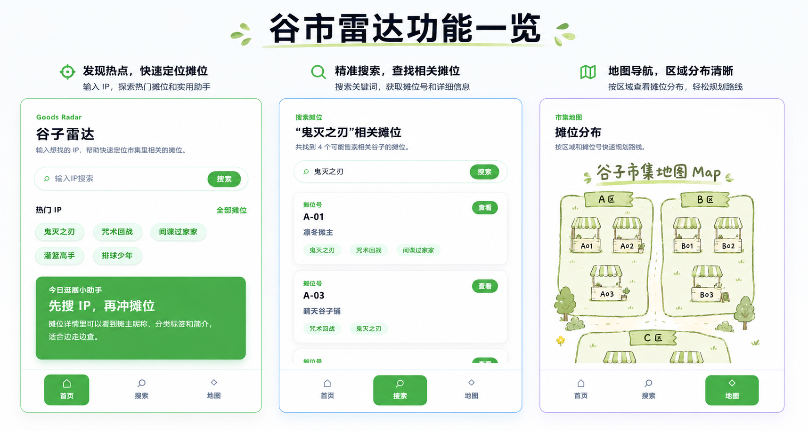

# Goods Radar

AI-powered product discovery platform for tracking trending products and generating smart insights.

---

## ✨ Features

- 🔍 Trending product monitoring
- 🤖 AI-generated product insights
- 📊 Analytics dashboard
- ⚡ Fast search & filtering
- 📱 Responsive modern UI

---

## 🛠 Tech Stack

- Next.js
- TypeScript
- Tailwind CSS
- Supabase
- Vercel
- OpenAI API

---

## 🚀 Demo

Live Demo:

[https://your-project.vercel.app](https://goods-radar.vercel.app)

---

## 📸 Screenshots

### Dashboard

<p align="center">
  
</p>


## 📦 Getting Started

Install dependencies:

```bash
npm install
```

Run development server:

```bash
npm run dev
```

Open:

```bash
http://localhost:3000
```

---

## 📁 Project Structure

```bash
app/          # Next.js app router
components/   # Reusable UI components
lib/          # Utilities and API logic
public/       # Static assets
```

---

## 👤 My Role

- Product planning
- UX design
- AI-assisted full-stack development
- Feature iteration

---

## 📄 License

MIT
